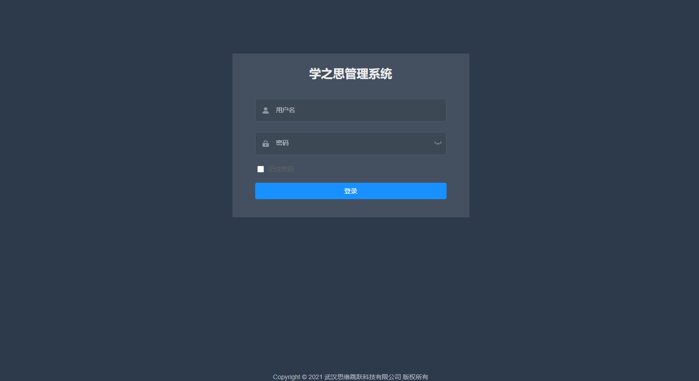
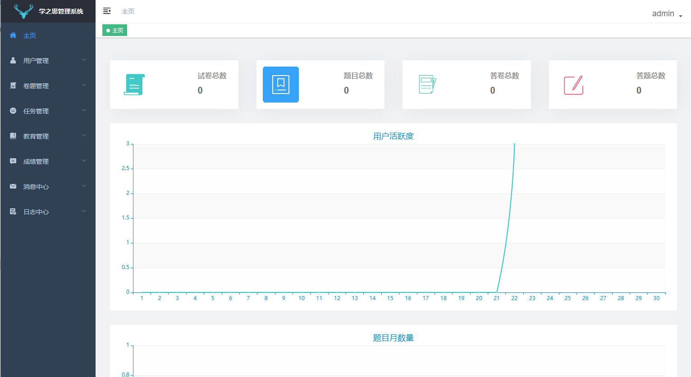
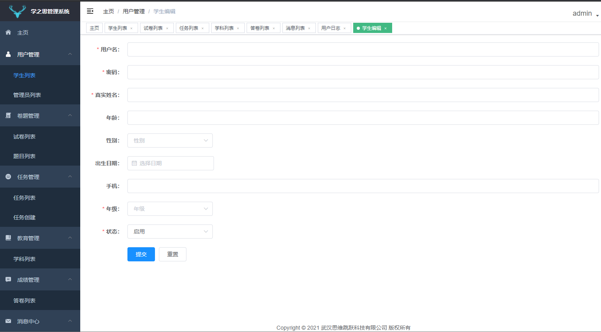
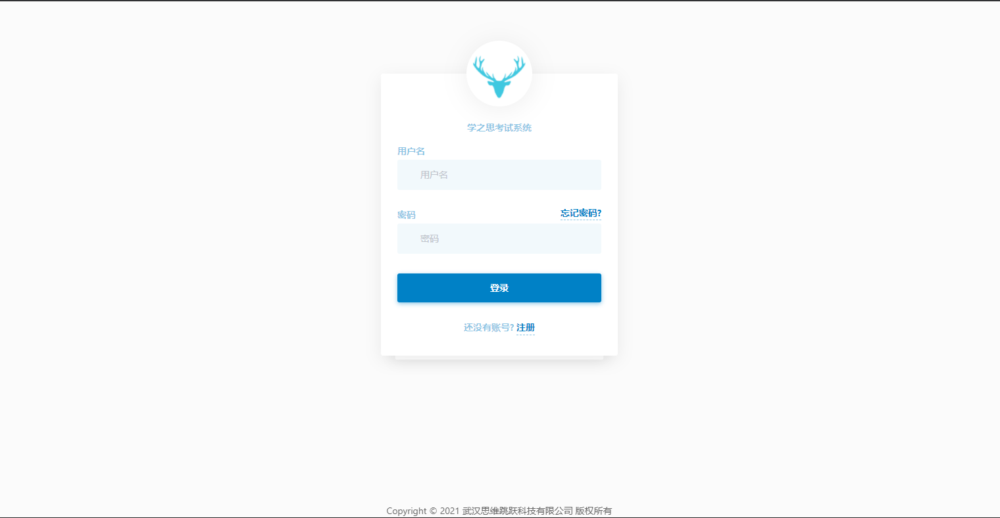

# Summer2021-No.17 为openEuler社区适配开源的学之思在线考试系统

#### 介绍
https://gitee.com/openeuler-competition/summer-2021/issues/I3E9IY  
学之思开源考试系统是一款 java + vue 的前后端分离的考试系统。主要优点是开发、部署简单快捷、界面设计友好、代码结构清晰。支持web端和微信小程序，能覆盖到pc机和手机等设备。 支持多种部署方式：集成部署、前后端分离部署、docker部署。

#### 软件架构
前端使用vue，后端使用java


#### 安装

安装学之思在线考试系统，使用以下 yum 命令安装学之思在线考试系统。

```bash
yum install -y xzs-3.3.0-1.x86_64.rpm
```

rpm 包里面已定义 学之思对于 redis 和 mysql 的依赖。所以在安装时，会自动安装redis和mysql。此时学之思考试系统就安装完成了

#### 启动

配置安装可参考[官方文档](https://www.mindskip.net:888/guide/deploy.html)

1. 启动redis

   ```bash
   systemctl start redis
   ```

2. 启动mysql

   ```bash
   systemctl start mysqld
   ```

3. 配置mysql的账号密码为root/123456

4. 导入从官网获取的xzs sql

5. 启动xzs

   ```bash
    nohup  java  -Duser.timezone=Asia/Shanghai   -jar -Dspring.profiles.active=prod /usr/share/xzs/xzs-3.3.0.jar  > /var/log/xzs.log  2>&1 &
   ```

   

#### 功能截图如下

使用http://127.0.0.1:8001/admin  访问管理页面，账号密码为admin / 123456

主页



使用http://127.0.0.1:8001/student 访问学生登录页面，账号密码为student / 123456

主页


